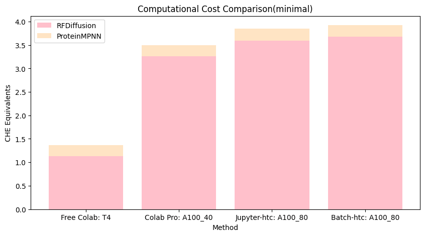
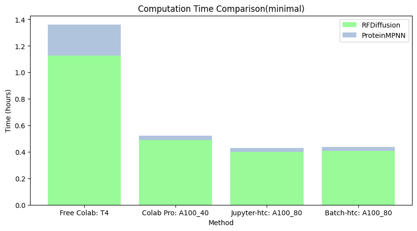
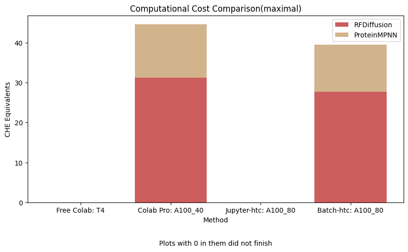
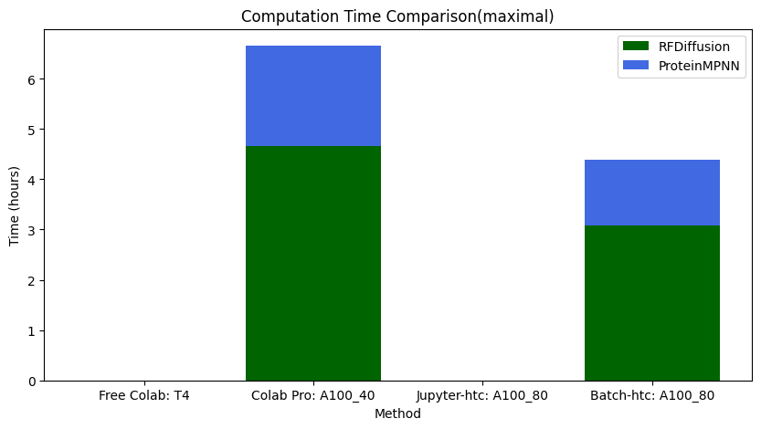

# openBind
Open Source Code for ASU iGEM 2024 De Novo Design Project


This Repository serves as a series of Colaboratory Notebooks and other implementations; feel free to tinker the code depending on the amount of compute resources you have available.
<p align="center">
  
</p>

## Usage
- Look into the README under the envs folder to set up environments
- generally, the flow will be to start with the ```generate``` folder, and then move to the ```bind``` folder
  - Within each folder, there will be two levels of organization -
    - for example, in ```generate```, you should start with RFDiffusion/ProteinMPNN before using FileFormatting1
    - Use the attached image for a specific flow
  - Unfortunately, I was unable to implement DynamicBind in google colab, but I will try in later updates to maybe change that


## Results: Computation Comparison
<p>
After assembling and cleaning the scripts which were used in the duration of this project, we decided to test our scripts and analyze the possible pros and cons of running each approach. Because our goal is accessibility, we decided to create two tasks, a minimal and a maximal task. This analysis does not include the binding prediction methods due to the extreme computational cost of both approaches, and the infeasibility to run full assays with those methods unless one is able to do so.

For each of the two aforementioned tests, we decided on four different platforms. These were Colab Free, Colab Pro, ASU’s HTC cluster Jupyter Instances, and ASU’s HTC cluster SLURM instances. The associated scripts that were used for these tests are in the github, which will be in the code availability section below. 
</p>
<p align="center">
  
</p>
<p>Figure 1: Compute Unit Comparison of minimally sufficient task</p>

<p align="center">
  
</p>
<p>Figure 1: Time Comparison of minimally sufficient task</p>

<p align="center">
  
</p>
<p>Figure 3: Compute Unit Comparison of maximal task</p>

<p align="center">
  
</p>
<p>Figure 4: Time Comparison of maximal task</p>

<hr>

<h5>Discussion
</h5>

<p>
  Although it may not be feasible to do a complete workflow on T4 GPUs and free google colab, it could still be possible. Our tests demonstrate the feasibility of minimal-computation approaches, as well as relatively cheaper approaches – one does not require the usage of HPC or university funding to start tinkering with and thinking about de novo design projects. The purpose of this work is to democratize and share code that has been developed over the course of this project’s cycle, and allow others to build upon pre-existing work.
</p>
<br>

For a more exact estimation of cost, the CHE to cost ratio according to [here](https://rescale.com/blog/the-real-cost-of-high-performance-computing) is $0.12/CHE. In Google Colab, the prices are 100 compute units for 10$, and running an A100 on the scripts we developed costs ~10-15 units per hour, which gives us a price approximation of $1-$1.5 per A100 hour. However, it is important to note that purchasing 100 compute units and then using T4GPU with colab pro will decrease the costs to only around 1.3-2 units per hour, which changes your price approximation to even lower than $0.12/hour. We do not advocate the usage of Google Colab Pro, but merely demonstrate it as a relatively accessible platform.


## References/Attributions:


[ColabDesign](https://github.com/sokrypton/ColabDesign)

[RFdiffusion](https://github.com/RosettaCommons/RFdiffusion)
```bibtex
    {
        RFdiffusion,
        title={{De novo design of protein structure and function with RFdiffusion.}}, 
        author={Watson, J.L., Juergens, D., Bennett, N.R. et al.},
        booktitle={Nature},
        year={2023},
        url={https://doi-org.ezproxy1.lib.asu.edu/10.1038/s41586-023-06415-8}
    }
```
[ProteinMPNN](https://github.com/dauparas/ProteinMPNN)
```bibtex
  {
      ProteinMPNN,
      title={{Robust deep learning–based protein sequence design using ProteinMPNN}}
      author = {J. Daupras et al.}
      booktitle={Science}
      year={2022}
      url={https://www.science.org/doi/10.1126/science.add2187}
  }
```
[GAABind](https://github.com/Mercuryhs/GAABind)
```bibtex
{
    GAABind,
    title = {{GAABind: a geometry-aware attention-based network for accurate protein–ligand binding pose and binding affinity prediction}}
    author = {H. Tan, Z. Wang, G. Hu, et al.}
    booktitle={Briefings in Bioinformatics, Volume 25, Issue 1}
    year={2024}
    url={https://doi-org.ezproxy1.lib.asu.edu/10.1093/bib/bbad462}
}
```

[DynamicBind](https://www-nature-com.ezproxy1.lib.asu.edu/articles/s41467-024-45461-2)
```bibtex
{
  DynamicBind,
  title={{DynamicBind: predicting ligand-specific protein-ligand complex structure with a deep equivariant generative model}}
  author={Lu, Wei and Zhang, Jixian and Huang, Weifeng and Zhang, Ziqiao and Jia, Xiangyu and Wang, Zhenyu and Shi, Leilei and Li, Chengtao and Wolynes, Peter G and Zheng, Shuangjia}
  booktitle={Nature Communications, Volume 15, Number 1, Page 1071}
  year={2024}
  publisher={https://www-nature-com.ezproxy1.lib.asu.edu/articles/s41467-024-45461-2}
}
```
