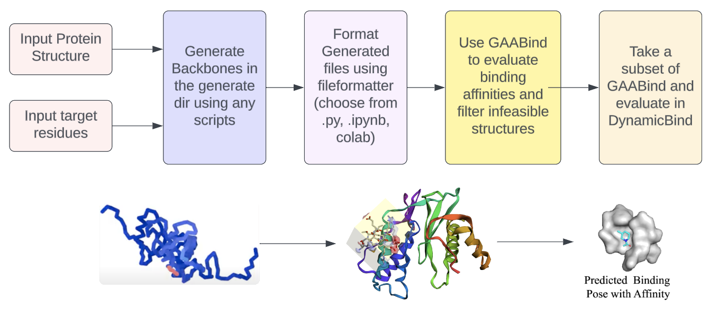

# openBind
Open Source Code for ASU iGEM 2024 De Novo Design Project


This Repository serves as a series of Colaboratory Notebooks and other implementations; feel free to tinker the code depending on the amount of compute resources you have available.
<p align="center">
  
</p>

## Usage
- Look into the README under the envs folder to set up environments
- generally, the flow will be to start with the ```generate``` folder, and then move to the ```bind``` folder
  - Within each folder, there will be two levels of organization -
    - for example, in ```generate```, you should start with RFDiffusion/ProteinMPNN before using FileFormatting1
    - Use the attached image for a specific flow
  - Unfortunately, I was unable to implement DynamicBind in google colab, but I will try in later updates to maybe change that


## Results: Comparison of runtimes for generating 64 binders
<p align="center">
  
</p>
<p>Figure 1: Comparison of minimally sufficient task</p>
<p align="center">
  
</p>
<p>Figure 2: Comparison of maximal task</p>
<hr>
  <p>
    In this section, we performed 40 runs of each method. In the minimal set, we generate 8 structures and 8 sequences. In the maximal set, we generate 32 structures and 16 sequences. We were only able to perform comparisons for the generation step so far, but we may yet finish computing the comparison between the binding steps.
  </p>
  <br>
  <p>Despite this, we elucidate some interesting results. Although it may not be feasible to do a complete workflow on T4 GPUs and free google colab, it could still be possible. At the end of the day, the importance is balancing the experimental design itself. In my view, it is possible to both generate complete garbage and some kind of miracle binder with perfect metrics; one just must be cognizant. Something that this workflow is bad at is reusing the same generated structures and sampling a more complete ProteinMPNN sequence space. However, it is important to note that the backprop method that ColabDesign uses is AF2, which is not without its faults. Unfortunately, DynamicBind is not possible to implement in colab, due to needing two conda environments, which is a limitation for open source methods.</p>
</div>


## References/Attributions:


[ColabDesign](https://github.com/sokrypton/ColabDesign)

[RFdiffusion](https://github.com/RosettaCommons/RFdiffusion)
```bibtex
    {
        RFdiffusion,
        title={{De novo design of protein structure and function with RFdiffusion.}}, 
        author={Watson, J.L., Juergens, D., Bennett, N.R. et al.},
        booktitle={Nature},
        year={2023},
        url={https://doi-org.ezproxy1.lib.asu.edu/10.1038/s41586-023-06415-8}
    }
```
[ProteinMPNN](https://github.com/dauparas/ProteinMPNN)
```bibtex
  {
      ProteinMPNN,
      title={{Robust deep learning–based protein sequence design using ProteinMPNN}}
      author = {J. Daupras et al.}
      booktitle={Science}
      year={2022}
      url={https://www.science.org/doi/10.1126/science.add2187}
  }
```
[GAABind](https://github.com/Mercuryhs/GAABind)
```bibtex
    GAABind,
    title = {{GAABind: a geometry-aware attention-based network for accurate protein–ligand binding pose and binding affinity prediction}}
    author = {H. Tan, Z. Wang, G. Hu, et al.}
    booktitle={Briefings in Bioinformatics, Volume 25, Issue 1}
    year={2024}
    url={https://doi-org.ezproxy1.lib.asu.edu/10.1093/bib/bbad462}
```

